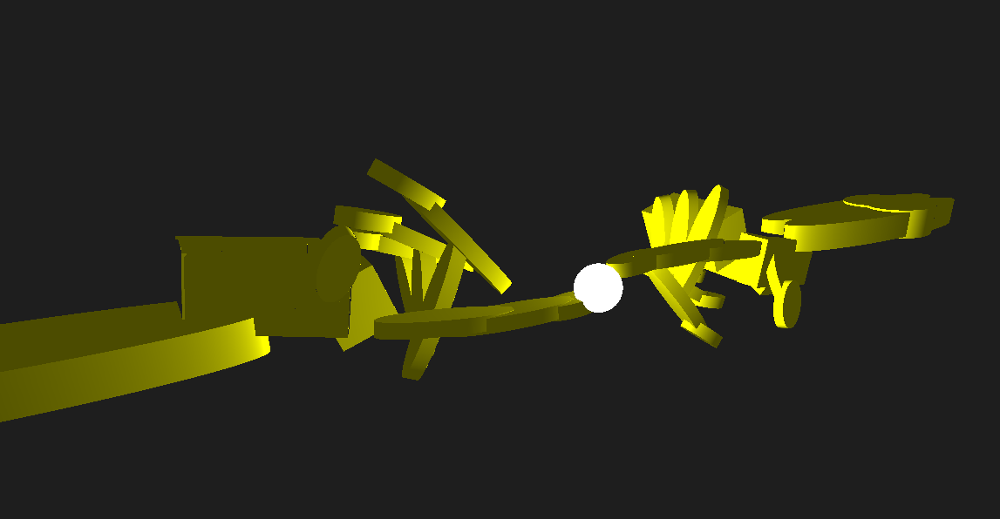

# CSG Ray-Marching

CSG Ray-Marching is a small educational/experimental renderer for Constructive Solid Geometry (CSG) scenes using Signed Distance Fields (SDF) and ray marching. 

It lets you compose primitives with boolean operations (union, intersection, subtraction), apply transforms and render images with basic lighting. This project was developed during the [STAG 2025](https://www.stag-conference.org/2025/pages/hackathon.html) conference hackathon, focused on CSG and ray marching.

## 1. Libraries, and Requirements

### Libraries Used

- [etu-opengl](https://github.com/bigmat18/etu-opengl) for OpenGL rendering
- [json](https://github.com/nlohmann/json) for json loading and formatting

### Software Requirements

- **C++:** >= C++23
- **CMake:** >= 3.20
- **Compiler:** GCC/Clang/MSVC with C++23 support

## 2. Install & Build

1) Clone the repo
```bash
git clone https://github.com/bigmat18/csg-raymarching.git
cd csg-raymarching
```

2) Configure and build
```bash
cmake -S . -B build -DCMAKE_BUILD_TYPE=Release
cmake --build build --config Release -j
```

3) Run the demo
```bash
./build/hackmore
```

## 3. Results
The final scene is based on a model built by [Davide Fantasia](https://github.com/DavideFantasia), inspired by “The Creation of Adam.” The scene is interactive and leverages the techniques
mentioned above.


## 4. Contributors


| Avatar | Name | Role | Links |
|---|---|---|---|
|  | **Matteo Giuntoni** | Programmer & Manteriner | [@bigmat18](https://github.com/bigmat18) • [LinkedIn](https://www.linkedin.com/in/matteo-giuntoni/) |


| Avatar | Name | Role | Links |
|---|---|---|---|
|  | **Davide Fantasia** | Modeling & Scene Design | [@DavideFantasia](https://github.com/DavideFantasia) • [LinkedIn](https://www.linkedin.com/in/davide-fantasia-a0334023b/) |
